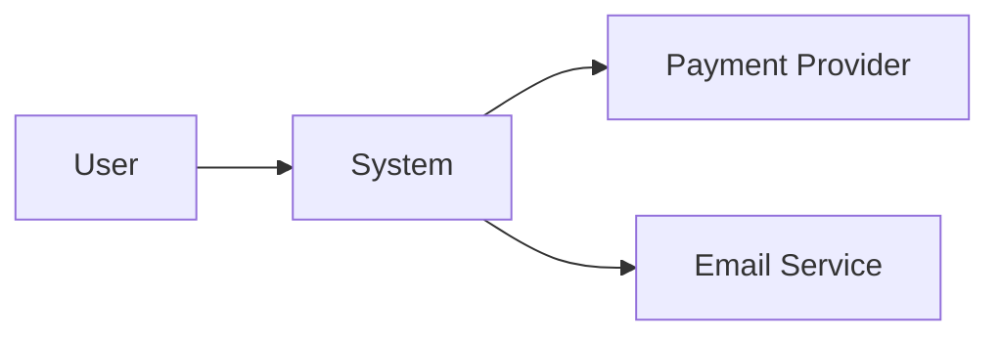
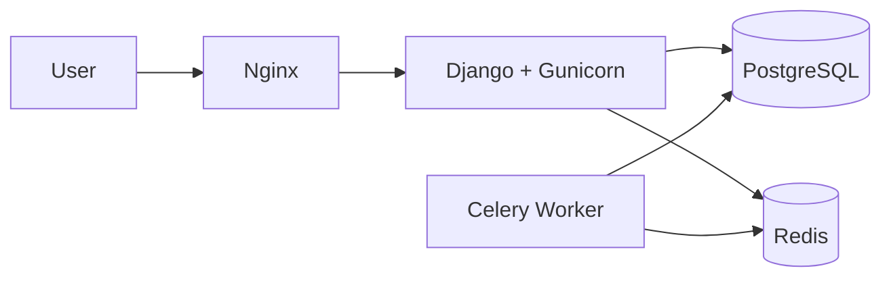

# README Generator & Architecture Docs

## Purpose

Generate and maintain project documentation grounded in the real codebase: README.md, architecture overviews (C4-inspired with Mermaid diagrams), Architecture Decision Records (ADRs), operational runbooks, and onboarding docs. Use when asked to "create a README", "document the architecture", "write an ADR", or "explain the project structure".

## Instructions

### 1. Investigate before writing (mandatory)

Never invent details — every claim must be verifiable in the repository:

1. Manifests: `pyproject.toml`/`requirements*.txt`, `package.json` — real dependencies, versions, and scripts.
2. Entry points: `manage.py`, `Dockerfile`, `docker-compose.yml`, `Makefile`, `.github/workflows/` — how it actually builds, runs, and deploys.
3. Structure: top-level directories, apps/modules, settings files; identify the architectural layers actually in use.
4. Existing docs: preserve useful content, fix stale content, delete wrong content (wrong docs are worse than no docs).
5. `.env.example` / settings — required environment variables (names and descriptions only, NEVER values).
6. Where feasible, RUN the setup commands you are about to document; a README with broken commands destroys trust.

**Decision rule — which document to produce**:
- Setup/usage question → README.
- "How does the system fit together" → `docs/architecture.md`.
- "Why did we choose X" → ADR.
- "What do I do when it breaks at 3am" → runbook.
Do not merge them into one giant file; do not create all four for a weekend script — match documentation weight to project weight.

### 2. README.md template

```markdown
# Project Name

One-sentence description of what it does and for whom.

## Tech Stack
Python 3.12 · Django 5 · DRF · PostgreSQL 16 · Docker · GitHub Actions

## Requirements
- Docker & Docker Compose (or Python 3.12 + PostgreSQL 16)

## Getting Started
```bash
git clone <repo> && cd <repo>
cp .env.example .env
docker compose up -d --build
docker compose exec web python manage.py migrate
docker compose exec web python manage.py createsuperuser
```
App: http://localhost:8000 — API docs: http://localhost:8000/api/docs/

## Environment Variables
| Variable | Description | Required | Default |
|---|---|---|---|
| DATABASE_URL | Postgres connection string | yes | — |

## Common Tasks
```bash
make test        # run test suite
make lint        # lint + format check
make migrate     # apply migrations
```

## Project Structure
Short annotated tree (only meaningful directories, one line each).

## Deployment
How CI/CD builds and deploys (link to workflow files and runbook).

## Documentation
- [Architecture](docs/architecture.md) · [ADRs](docs/adr/) · [Runbook](docs/runbook.md)

## License
```

Rules:
- Every command must actually work — verified against the repo, run when feasible.
- Scannable: tables for env vars, short annotated tree, no walls of text; badges only if they carry signal (CI status, coverage).
- The README is the front door, not the encyclopedia: link to `docs/` for depth instead of bloating it.
- Target: a new developer is running the project in **< 30 minutes** using only the README.

### 3. Architecture document (`docs/architecture.md`) — C4-inspired

1. **Context (C4 L1)** — what the system does, external actors and systems (users, payment provider, email service):



2. **Containers (C4 L2)** — deployable units and their communication:



3. **Components (C4 L3)** — main apps/modules and their responsibilities, one line each, plus the dependency rule between layers (views → services → models). Go deeper than one diagram per level only when a container is genuinely complex.
4. **Data model** — key entities and relations (Mermaid `erDiagram`, the core 5–10 tables only — the schema itself is the source of truth for the rest).
5. **Cross-cutting concerns** — authN/authZ model, error handling and error contract, logging/observability, background jobs, caching (what and why).
6. **Deployment view** — environments, CI/CD flow, how a commit becomes a release.

Rules:
- Diagrams in Mermaid (renders on GitHub, diffable in PRs) — never binary images that rot.
- Each diagram answers ONE question for ONE audience; a diagram needing a 10-minute explanation is a failed diagram.
- Describe the CURRENT state; aspirations go to ADRs or the roadmap, clearly labeled.

### 4. ADRs (`docs/adr/NNNN-title.md`)

Record significant decisions — those that are expensive to reverse or that a future developer will question ("why Postgres and not Mongo", "why monolith", "why JWT"):

```markdown
# 0001. Use PostgreSQL as primary database
Date: 2026-07-28
Status: Accepted

## Context
[Forces at play: requirements, constraints, options considered]

## Decision
[What was decided, and what was explicitly rejected]

## Consequences
[Positive and negative outcomes, follow-ups, revisit triggers]
```

- One decision per file, numbered sequentially; never edit accepted ADRs — supersede (`Status: Superseded by 0007`).
- **When NOT to write an ADR**: reversible, low-impact choices (a lib for date formatting) — noise buries the decisions that matter.

### 5. Runbook (`docs/runbook.md`) — for anything deployed

- How to: deploy, roll back (exact commands), check health/logs/metrics, run migrations manually, restore a backup.
- Top known failure modes and their first-response steps.
- Keep it executable and terse — a runbook is read under stress.

### 6. Onboarding and maintenance

- Onboarding path = README (run it) → architecture.md (understand it) → first-issue conventions (contribute to it). If a new developer asks a question twice, the answer belongs in the docs.
- Docs live in the repo and change in the SAME PR that changes behavior, setup, env vars, or architecture — add this to the PR review checklist.
- Schedule a lightweight quarterly docs review: run the README top to bottom, prune stale content.

## Checklists

### Before implementing
- [ ] Repo investigated (manifests, entry points, workflows, env vars) — no invented facts
- [ ] Right document type chosen for the need (README/architecture/ADR/runbook)
- [ ] Audience identified (new dev, operator, decision reviewer)

### During implementation
- [ ] Commands copied from real scripts/Makefile and verified
- [ ] Env vars documented by name/description only — zero real values, tokens, or internal hostnames
- [ ] Diagrams in Mermaid; each answers one question
- [ ] Current state only; aspirations labeled as such

### Before delivering
- [ ] Getting Started executed end-to-end (or each command verified against the repo)
- [ ] Links valid (files exist, anchors resolve)
- [ ] Stale/contradicting older docs updated or removed in the same change
- [ ] A newcomer could reach a running app in < 30 min with only this doc

## Best Practices

- Prefer examples over prose; tables over paragraphs for reference data.
- Wrong documentation is worse than missing documentation — delete what you can't verify.
- Documentation weight matches project weight: a script gets a README section, a production system gets the full set.
- Write for the new developer joining the team, not for the author.

## Triggers

- "README", "documentação", "arquitetura", "ADR", "diagrama", "documentar projeto", "onboarding", "runbook", "architecture docs"

## Related Skills

- `django`, `docker`, `postgresql`, `github-actions`, `ci-cd`: sources of truth for what to document
- `git-commit`: `docs:` commit type for documentation changes
